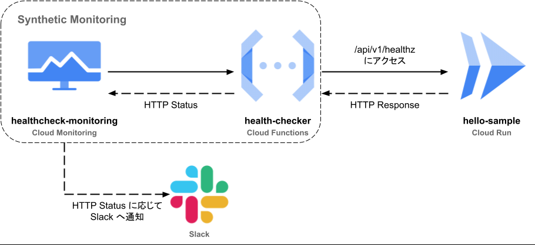
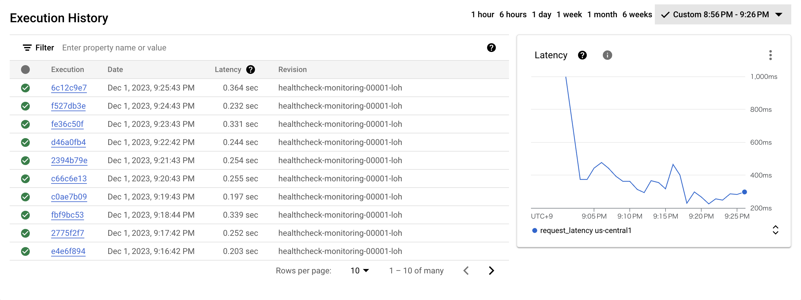

<div align="center">

<h1>Synthetic Monitoring Sample</h1>

</div>



## Terraform のインストール
```sh
brew install tfenv

# 指定バージョンをインストールする
cd environments/dev
tfenv install $(cat .terraform-version)
tfenv use $(cat .terraform-version)
```

## Google Cloud にリソースを作成する

### 1. terraform.tfvars を作成する
```hcl
# environments/dev/terraform.tfvars
project_id = "hogehoge" # 任意のプロジェクト ID を指定する
```

### 2. リソースを作成する
```sh
# Terraform 構成ファイルを含む作業ディレクトリを初期化する冪等のコマンド
terraform init

# 差分を確認する
terraform plan

# 再度差分が出力されるが，問題なければ yes と入力する
terraform apply
```

## Console 上で確認
https://console.cloud.google.com/monitoring/synthetic-monitoring にアクセスすると以下の様な外形監視の履歴が見れます．


